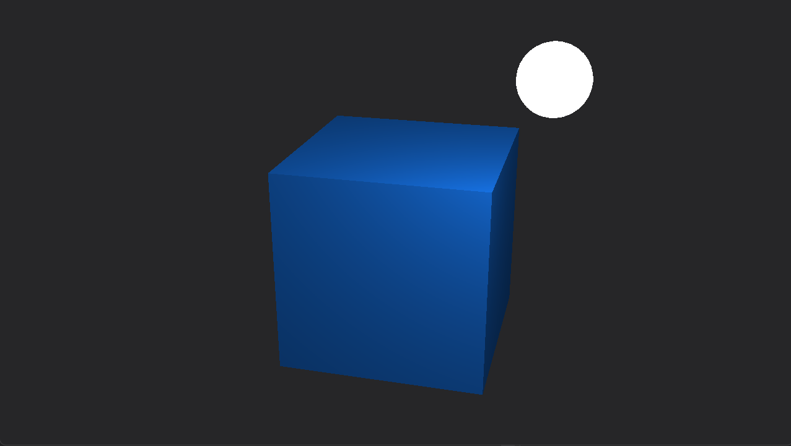

<h1>Симулятор полета</h1>

Планируется разработка визуализатора будущего виртуального испытательного стенда БПЛА самолетного типа. Данный визуализатор будет включать в себя:

<ul>
  <li>Графический движок, разработанный с помощью графического API - OpenGL 3.3 Core Profile</li>
  <li>Физический движок (самописный), оснван на численном решении задачи Коши для расчета траектории полета БПЛА</li>
  <li>GUI для взаимодействия инженеров-расчетчиков с визуализатором</li>
  <li>Возможна интеграция с любыми программными инструментами</li>
</ul>

На данный момент был разработан программный интерфейс графического движка, с помощью которого имеется возможность загружать и проводить аффинные преобразования над трехмерными моделями. В дальнейшем возможно более детальное развитие этого компонента визуализатора. Все вышеперечисленное будет разработанно в ближайшем будущем.

На данный момент демонстрационная версия выглядит так:

<h2>Программная составляющая</h2>

UPDATE: Добавлена возможность загружать модели, созданные в популярных графических редакторах, таких как: blender, 3ds Max, и прочие.

UPDATE: Доработан графический движок. Добавлена модель освещения Фонга. Освещенная сцена сейчас может выглядеть так:

<ul>
  <li>Вектора и матрицы (файл <a href="sources/transform.hpp">tranform.hpp</a>), необходим для взаимодействия с трехмерным пространством сцены. Переводу между         различными системами координат, а в общем случае - произведению аффинных преобразований</li>
  <li>Класс модели (файл <a href="sources/model.hpp">model.hpp</a>), необходим для хранения моделей и применению к ним аффинных преобразований в собственном             локальном пространстве и переводу в общее для всех моделей мировое пространство. Модель может быть составной и состоять из нескольких мешей (файл <a                 href="sources/mesh.hpp">mesh.hpp</a>)</li>
  <li>Класс камеры (файл <a href="sources/camera.hpp">camera.hpp</a>), необходим для перевода всех моделей на сцене в пространство обзора камеры. Позволяет             менять точку и ракурс обзора на усмотрение пользователя</li>
  <li>Класс загрузки модели (файл <a href="sources/loader.hpp">loader.hpp</a>), необходим для импорта моделей, созданных в других графических редакторах</li>
  <li>Прочие классы, являющиеся по большей части объектной оболочкой, необходимой для взаимодействия с OpenGL</li>
</ul>

Разработка на данный момент активно ведется, почти каждый день будут появляться новые коммиты. В ближайшее время будет начата разработка физического движка!

Разработка ведется на языке С++ при использовании фреймворка GLFW, необходимого для взаимдействия с функциями OpenGL.

